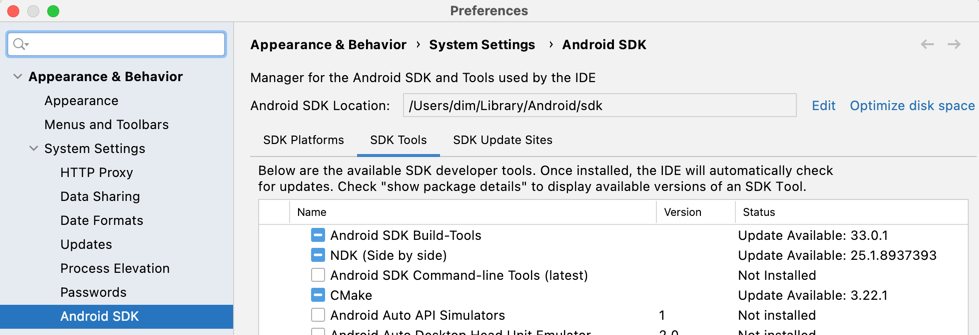

## Building JVM bindings

* Set JAVA_HOME to location of JDK, at least version 11
* If you have **Apple silicon CPU (M1)**, better to use **X86** JDK architecture to compile JS target.
* `./gradlew :skiko:publishToMavenLocal` will build the artifact and publish it to local Maven repo

To build with debug symbols and debug Skia build use `-Pskiko.debug=true` Gradle argument.

#### Working with Skia sources

Gradle build downloads the necessary version of Skia by default.
However, if downloaded sources are modified, changes are discarded (Gradle
re-evaluates tasks, when outputs are changed).
To use custom version of the dependencies, specify `SKIA_DIR` environment variable.

#### Building on Windows

##### Using Visual Studio C++
* Install [Visual Studio Build Tools](https://visualstudio.microsoft.com/visual-cpp-build-tools/) or
  [Visual Studio C++](https://visualstudio.microsoft.com/vs/features/cplusplus/).
* If Gradle fails to find Visual C++ toolchain:
```
Execution failed for task ':compileDebugWindowsCpp'.
> No tool chain is available to build C++ for host operating system 'Windows 10' architecture 'x86-64':
    - Tool chain 'visualCpp' (Visual Studio):
        - Could not locate a Visual Studio installation, using the command line tool, Windows registry or system path.
```
set `SKIKO_VSBT_PATH` environment variable to the location of installed Visual Studio Build Tools.
This could be done in the UI:
```
Control Panel|All Control Panel Items|System|Advanced system settings|Environment variables
```
or by running `cmd` as administrator:
```
setx /M SKIKO_VSBT_PATH "C:\Program Files (x86)\Microsoft Visual Studio\2019\BuildTools"
```

#### Running UI tests
Add `-Dskiko.test.ui.enabled=true` to enable UI tests (integration tests, which run in the native window). Each UI test will be run on every available Graphics API of the current target.

For example, if we want to include UI tests when we test JVM target, call this:
```
./gradlew awtTest -Dskiko.test.ui.enabled=true
```
Don't run any background tasks, click mouse, or press keys during the tests. Otherwise, they probably fail.

## Run samples
* First follow the instruction here: [Building JVM bindings](#building-jvm-bindings)
### samples/SkiaAwtSample
```bash
./gradlew :skiko:publishAllSkikoJvmRuntimeToMavenLocal &&\
./gradlew :SkiaAwtSample:run -Pskiko.version=0.0.0-SNAPSHOT
```
 - skiko.fps.longFrames.show=true
```bash
./gradlew :skiko:publishAllSkikoJvmRuntimeToMavenLocal &&\
./gradlew :SkiaAwtSample:run -Dskiko.fps.longFrames.show=true -Pskiko.version=0.0.0-SNAPSHOT
```
 - skiko.renderApi=SOFTWARE
```bash
./gradlew :skiko:publishAllSkikoJvmRuntimeToMavenLocal &&\
./gradlew :SkiaAwtSample:run -Dskiko.renderApi=SOFTWARE -Pskiko.version=0.0.0-SNAPSHOT
```
 - skiko.vsync.enabled=false
```bash
./gradlew :skiko:publishAllSkikoJvmRuntimeToMavenLocal &&\
./gradlew :SkiaAwtSample:run -Dskiko.vsync.enabled=false -Pskiko.version=0.0.0-SNAPSHOT
```
 - skiko.transparency=true
```bash
./gradlew :skiko:publishAllSkikoJvmRuntimeToMavenLocal &&\
./gradlew :SkiaAwtSample:run -Dskiko.transparency=true -Pskiko.version=0.0.0-SNAPSHOT
```
 - skiko.swing.interop=true
```bash
./gradlew :skiko:publishAllSkikoJvmRuntimeToMavenLocal &&\
./gradlew :SkiaAwtSample:run -Dskiko.swing.interop=true -Pskiko.version=0.0.0-SNAPSHOT
```

### samples/SkiaJsSample with mavenLocal
If page in Browser will empty - just reload page.
```bash
./gradlew publishToMavenLocal -p skiko -Pskiko.native.enabled=true -Pskiko.wasm.enabled=true &&\
./gradlew jsBrowserDevelopmentRun -p samples/SkiaJsSample -Pskiko.version=0.0.0-SNAPSHOT
```

### samples/SkiaJsSample with skikoCompositeBuild=true
It means: includeBuild("skiko") with dependency substitution. It compiles faster.
```bash
./gradlew publishSkikoWasmRuntimePublicationToMavenLocal -p skiko -Pskiko.native.enabled=true -Pskiko.wasm.enabled=true &&\
./gradlew jsBrowserDevelopmentRun -p samples/SkiaJsSample -Pskiko.wasm.enabled=true -DskikoCompositeBuild=true -Pskiko.version=0.0.0-SNAPSHOT
```

### samples/SkiaMultiplatformSample JVM, Native and JS
If page in Browser will empty - just reload page.  
```bash
./gradlew publishToMavenLocal -p skiko -Pskiko.native.enabled=true -Pskiko.wasm.enabled=true &&\
./gradlew runAwt runNative jsBrowserDevelopmentRun -p samples/SkiaMultiplatformSample -Pskiko.version=0.0.0-SNAPSHOT
```
#### Run iOS
- Open SkiaMultiplatformSample project in AppCode with KMM plugin.
- Run iOS on simulator

### samples/SkiaMultiplatformSample JVM, Native and JS with skikoCompositeBuild=true
It means: includeBuild("skiko") with dependency substitution. It compiles faster.  
If page in Browser will empty - just reload page.  
```bash
./gradlew publishAllSkikoJvmRuntimeToMavenLocal publishSkikoWasmRuntimePublicationToMavenLocal -p skiko -Pskiko.native.enabled=true -Pskiko.wasm.enabled=true &&\
./gradlew runAwt runNative jsBrowserDevelopmentRun -p samples/SkiaMultiplatformSample -Pskiko.native.enabled=true -Pskiko.wasm.enabled=true -DskikoCompositeBuild=true -Pskiko.version=0.0.0-SNAPSHOT
```

### samples/SkiaAndroidSample
 - Download Android NDK (Side by side)  

 - Add local.properties with key `sdk.dir=...`
 - Connect Android device or emulator
```bash
./gradlew publishToMavenLocal -p skiko -Pskiko.android.enabled=true &&\
./gradlew installDebug -p samples/SkiaAndroidSample -Pskiko.android.enabled=true -Pskiko.version=0.0.0-SNAPSHOT ||\
./gradlew assembleDebug -p samples/SkiaAndroidSample -Pskiko.android.enabled=true -Pskiko.version=0.0.0-SNAPSHOT
```
