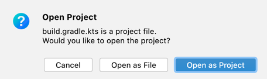
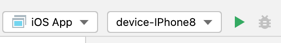

# Skia multiplatform samples

## run iOS with Xcode
 - Work's only on Mac with Intel CPU
 - Install xcodegen
 - run `xcodegen`
 - run `open SkikoSample.xcodeproj`

## run iOS with debug in AppCode
 - If you need to debug skiko sources without publish to maven local, then set environment variable `export SKIKO_COMPOSITE_BUILD=1` (on MacOS in ~/.zshrc)
 - Install KMM plugin for AppCode
 - In AppCode open samples/SkiaMultiplatformSample (File -> Open).
Choose "Open as Project".

 - Set target device and Run

 - Now you may use breakpoints in common and native Kotlin code

## run on browser:
 - `./gradlew jsBrowserRun`

## run desktop awt:
 - `./gradlew runAwt`

## run desktop on native MacOS
 - `./gradlew runNative`
