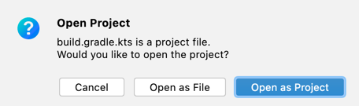
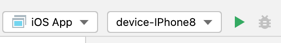

## How to run:
 - Install KMM plugin for AppCode
 - In AppCode open samples/ios-appcode/build.gradle.kts (File -> Open).
Choose "Open as Project".

 - Set target device and Run

 - Now you may use breakpoints in common and native Kotlin code

